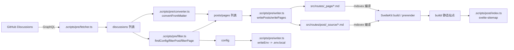

# 整体架构与数据流

## 1. 架构分层

- **构建期（数据侧）**：`.scripts/pre/*` 从 GitHub GraphQL 拉取 discussions → 写入本地 Markdown 源文件 + `.env.local`
- **构建期（站点侧）**：SvelteKit 预渲染 + mdsvex 把 Markdown 编译为可渲染的 Svelte 组件
- **运行期（站点侧）**：路由 `load()` 通过 `import.meta.glob()` 聚合 Markdown 模块 → 过滤/排序/分页 → 组件渲染
- **构建后（产物侧）**：`.scripts/post/index.ts`（可选）生成 sitemap

## 2. 数据流（从 Discussions 到页面）

## 3. 配置注入链路（VITE_*）

- `.scripts/pre/index.ts` 将 config 与环境变量合并，最终写入 `.env.local`
  - 入口：[.scripts/pre/index.ts](file:///workspace/.scripts/pre/index.ts)
  - 写入逻辑：[writeEnv](file:///workspace/.scripts/pre/writer.ts#L28-L33)
- 前端运行时通过 [constants.ts](file:///workspace/src/lib/constants.ts) 使用 `import.meta.env.VITE_*` 读取
- 典型使用点：
  - SEO/站点信息：`BLOG_NAME / DESCRIPTION / KEYWORDS`（布局页 [__layout-withoutHeader.svelte](file:///workspace/src/routes/__layout-withoutHeader.svelte#L21-L35)）
  - Atom feed：`DOMAIN`（[atom.xml.ts](file:///workspace/src/routes/atom.xml.ts#L6-L10)）
  - 评论：`USER_NAME / REPOSITORY / COMMENT`（[Giscus.svelte](file:///workspace/src/lib/components/Giscus.svelte#L1-L25)）

## 4. 关键设计点

### 4.1 “内容即代码”的实现方式

- 讨论内容被落盘为：
  - 文章：`src/routes/post/_source/[number].md`（由 [writePosts](file:///workspace/.scripts/pre/writer.ts#L5-L15) 写入）
  - 页面：`src/routes/_page/[title].md`（由 [writePages](file:///workspace/.scripts/pre/writer.ts#L17-L26) 写入）
- mdsvex 将 `.md` 作为路由可消费的模块，模块形态在运行期被 `import.meta.glob()` 动态加载：
  - posts：[fetchPosts](file:///workspace/src/lib/helper/fetchPosts.ts#L9-L50)
  - pages：[fetchPages](file:///workspace/src/lib/helper/fetchPage.ts#L9-L25)

### 4.2 国际化/语言处理（HTML lang）

- Hook 在服务端渲染阶段替换 `app.html` 中的 `%lang%` 占位符
- 逻辑：根据 route id 决定读取 post/page 的 `metadata.lang`，否则回退到 `LANGUAGE`
- 入口：[hooks.server.ts](file:///workspace/src/hooks.server.ts#L6-L34)

