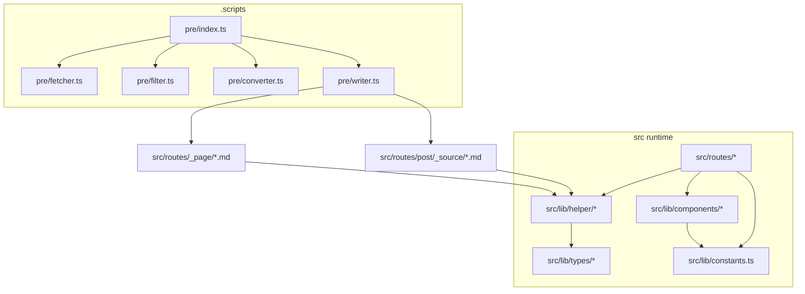

# 依赖关系（Packages / Modules）

## 1. 技术栈与版本约束

- Node.js：`>=22`（见 [package.json](file:///workspace/package.json#L4-L6)）
- Svelte：`^5.x`
- SvelteKit：`^2.x`
- TypeScript：`5.9.x`
- 构建：Vite `^8.x`
- 输出：`@sveltejs/adapter-static`（静态站点，fallback `404.html`）

## 2. 关键三方包（按职责）

### 2.1 框架与构建

- `@sveltejs/kit`：路由、SSR/Prerender、load/hook 等框架能力
- `@sveltejs/adapter-static`：静态导出
- `vite` / `@sveltejs/kit/vite`：开发服务器与构建
- `tsx`：执行 TypeScript 脚本（用于 `.scripts/*`）

### 2.2 Markdown 管线（内容编译）

- `mdsvex`：把 `.md` 作为 Svelte 组件/路由内容
- `rehype-*`：Markdown → HTML 处理链
  - `rehype-slug`：标题生成 id
  - `rehype-autolink-headings`：标题自动链接
  - `rehype-external-links`：外链 target=_blank
  - `rehype-add-classes`：给标题加 class（用于样式）
- 配置入口：[svelte.config.js](file:///workspace/svelte.config.js#L1-L41)

### 2.3 数据拉取与格式化（构建期）

- `node-fetch`：调用 GitHub GraphQL
- `dotenv`：读取 `.env` 与解析 discussion 里的 dotenv 文本
- `yaml`：解析/生成 Markdown front matter（YAML）

### 2.4 SEO / Feed / Sitemap

- `feed`：生成 Atom XML（[atom.xml.ts](file:///workspace/src/routes/atom.xml.ts)）
- `svelte-sitemap`：构建后生成 sitemap（[.scripts/post/index.ts](file:///workspace/.scripts/post/index.ts)）

### 2.5 UI / 样式 / 图标

- `tailwindcss` + `@tailwindcss/typography`：样式与 prose 排版（见 `app.css`、[Article.svelte](file:///workspace/src/lib/components/Article.svelte)）
- `@fortawesome/fontawesome-free`：分页箭头 SVG（[Pagination.svelte](file:///workspace/src/lib/components/Pagination.svelte#L1-L4)）
- `clsx`：className 拼接（[Pagination.svelte](file:///workspace/src/lib/components/Pagination.svelte#L1-L4)）
- `@giscus/svelte`：评论组件封装（[Giscus.svelte](file:///workspace/src/lib/components/Giscus.svelte#L1-L25)）

## 3. 内部模块依赖（高层图）

## 4. “依赖方向”约定（便于扩展/重构）

- `src/routes/*` 依赖 `src/lib/*`，避免反向依赖（lib 不引用 routes）
- `.scripts/*` 独立于 `src/lib/*`（当前已分离），减少构建期与运行期耦合
- 运行期对内容的读取全部集中在 `src/lib/helper/*`，路由层只做参数解析与 UI 组合

